# DsuFramework

## Overview

게임을 만들 때, 게임을 구성하는 각각의 요소를 독립적으로 유지보수 가능하게 만드는 것은 매우 중요합니다. 예를 들면 Player 스크립트가 Player와 연관된 Mechanic을 처리하면서, Animation과 UI를 함께 처리하는 것은 나쁜 방법입니다. 왜냐하면 Animation이 변경되거나, UI가 변경되면 Player스크립트를 수정해야 하기 때문입니다.

이러한 문제점을 해결하는 일반적인 방법은, 두 계층 사이에 새로운 간접 계층을 두어서 문제를 해결하는 것입니다. 예를 들면 데이터를 관리하는 Model과 렌더링을 담당하는 View의 커플링을 해결하기 위해서는 Controller를 도입할 수 있습니다. 그러면 Model과 View는 독립적으로 유지보수할 수 있습니다. 이것을 MVC패턴이라고 합니다.

게임플레이가 충돌을 포함하는 경우, 이것을 처리하는 방법에 따라 객체간 의존성이 발생할 수 있습니다. 예를 들면 Player가 Item과 충돌한 경우, Player의 OnTriggerEnter() 에서 충돌을 처리할 수 있습니다. 그러면 OnTriggerEnter()는 Player의 메서드로 구현되어야 합니다. 하지만, Player와 Item의 충돌을 처리하는 함수는 두 객체를 사용하는 함수이므로 Player 혹은 Item의 메서드로 구현하는 것은 적절하지 않습니다. 또한, 해당하는 이벤트를 여러곳에서 처리해야 한다면, Player 구현의 커플링을 증가시킵니다. 이것을 해결하는 방법은 Game Event를 Scriptable Object로 만들어 간접층을 추가하는 것입니다.

Unity의 GameObject 클래스는 sealed로 구현되어 있어서 메서드를 추가하는 것이 불가능합니다. 그래서 게임객체의 종류별로 무언가를 처리해야 할 때, 일반적으로 Tag를 사용해서 처리합니다. GameObject에 임의로 사용자가 속성을 추가할 수 있다면, 매우 편리해 집니다. 예를 들면 count라는 속성을 게임 객체에 추가하고, GetCount()로 count값을 읽을 수 있다면, 레벨 편집이 쉬워 집니다. 이러한 구현은 Extension method로 구현할 수 있는데, GetCount()등의 함수 호출이 상수시간에 가능하도록, 또한 임의의 객체에 대해서도 GetCount() 호출이 가능하도록 구성할 수 있습니다.


## Features

DsuFramework은 다음과 같은 특징을 제공합니다.

1. UI를 다른 곳과 분리시켜서 독립적으로 코드를 유지합니다. UI데이터가 변경되었을 때만 특정한 핸들러를 호출하도록 합니다.
2. Gameplay와 관련된 이벤트를 독립적으로 유지하고, 여러곳에서 Gameplay관련 이벤트를 처리할 수 있습니다.
3. GameObject에 사용자 정의 속성을 추가할 수 있습니다. 자세한 컨트롤리 필요한 게임객체에는 GameObjectProperty 컴포넌트를 추가해서 세밀한 컨트롤이 가능합니다.

아래 링크에서 공굴리기 게임의 소스를 다운받을 수 있습니다. 이 게임에 DsuFramework을 적용해서 어떻게 개선할 수 있는지 살펴보겠습니다.

[Roll-a-Ball Project](https://assetstore.unity.com/packages/essentials/tutorial-projects/unity-learn-3d-beginner-roll-a-ball-complete-project-urp-77198)

프로젝트는 원래 Roll-a-Ball구현과 DsuFramework을 적용한 Roll-a-Ball-New를 포함하고 있습니다. 이전의 구현이 어떻게 변경되었는지 비교하면서 확인할 수 있습니다.

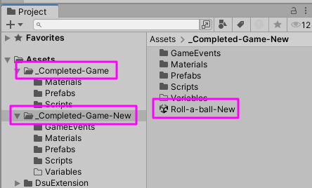

## 1. UI MVC Pattern

아래 그림은 기존의 Roll-a-Ball에서 UI를 어떻게 처리하는지 보여줍니다.

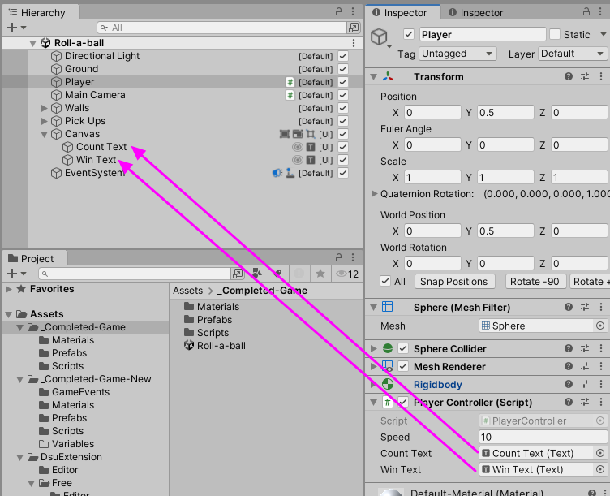

Canvas의 자식 객체로 Count Text와 Win Text가 있습니다. 이것을 Player가 참조하고 있습니다. 이것은 매우 나쁜 방법입니다. UI와 관련된 코드는 UI 와 관련된 게임객체에서만 접근하도록 코드를 구성해야 합니다.

기존 Roll-a-Ball의 PlayerController.cs를 보면 Text를 접근하는 코드가 다음과 같이 선언되어 있는 것을 확인할 수 있습니다.

``` csharp
public class PlayerController : MonoBehaviour {
	
	// Create public variables for player speed, and for the Text UI game objects
	public float speed;
	public Text countText;
	public Text winText;
```

위 코드에서 countText와 winText를 모두 제거할 필요가 있습니다. 그러면 PlayerController는 오직 Player와 관련된 Gameplay만 관리하면 되므로 커플링이 줄어듭니다.

---

아래의 코드는 Canvas의 컴포넌트로 추가된 UIController에서 Count Text와 Win Text를 참조하는 것을 보여줍니다.

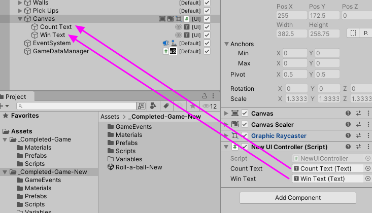

이렇게 PlayerController와 UI를 분리하기 위해서는 Player에 의해서 Update되는 데이터를 관리해줄 중간 계층이 필요합니다. 그것이 RuntimeGameDataManager입니다. Player는 아이템과 충돌하면, UI를 접근하는 것이 아니라, RuntimeGameDataManager가 관리하는 데이터를 접근하고 갱신합니다. 그리고 UIController는 RuntimeGameDataManager를 접근해서 UI 데이터가 변경되었는지를 감시하고 있다가, 데이터가 변경된 경우 UI를 Update합니다.

RuntimeGameDataManager와 UIController는 아래 그림처럼 메뉴를 사용해서 코드 템플릿을 생성할 수 있습니다.

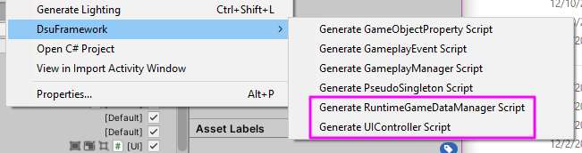

그리고 Empty GameObject를 하나 만들어서, GameDataManager라고 이름을 정하고 RuntimeGameDataManager 컴포넌트를 부착합니다. 그리고 Canvas에는 UIController를 부착합니다.

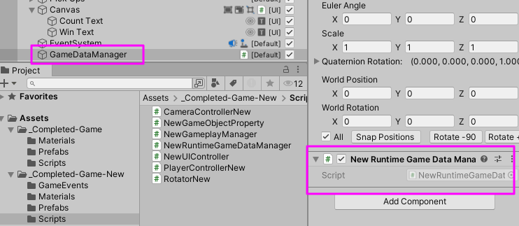

RuntimeGameDataManager에는 count를 유지하도록 코드를 추가합니다.

``` csharp
public class NewRuntimeGameDataManager : RuntimeGameDataManagerBase
{
    static public NewRuntimeGameDataManager instance = null;

    private int count;

    public int Count
    {
        get { return count; }
        set { _UpdateDataStamp(); count = value; }
    }
```

count값이 변경되었을 때만, 렌더링을 Update하기 위해서 setter에서는 _UpdateDataStamp()를 호출할 필요가 있습니다.

PlayerController에서는 이제 아이템과 충돌했을 때, RuntimeGameDataManager를 접근해서 데이터를 Update합니다.

``` csharp
	void OnTriggerEnter(Collider other) 
	{
		// ..and if the game object we intersect has the tag 'Pick Up' assigned to it..
		if (other.gameObject.CompareTag ("Pick Up"))
		{
            NewRuntimeGameDataManager.instance.Count += 1;
		}
	}
```

그러면 UIController의 UpdateData()가 호출됩니다. 이 안에서 UI를 Update하도록 코드를 구성합니다.

``` csharp
public class NewUIController : UIControllerBase
{
    public Text countText;
    public Text winText;

    protected override void UpdateData(int groupId)
    {
        SetCountText();
    }
```

UIController가 한 Scene에 여러개 존재하는 경우, 모든 UIController의 UpdateData()가 호출됩니다. 이것을 구분하기 위해서 groupId를 사용할 수 있습니다. 예를 들면 아래와 같이 호출하면 groupId에 1이 전달됩니다.

``` csharp
_UpdateDataStamp(1)
```

게임의 모든 UI가 제대로 구성되었는지를 검사하기 위해서 UIReferenceFinder를 사용할 수 있습니다.

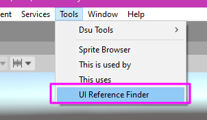

툴을 실행하고 'Find Bad UI Reference'버튼을 선택하면, 현재 Hierarchy를 스캔해서 잘못된 UI참조를 보고합니다. 이렇게 발견된 부분은 UIController를 사용하도록 코드를 수정할 필요가 있습니다.

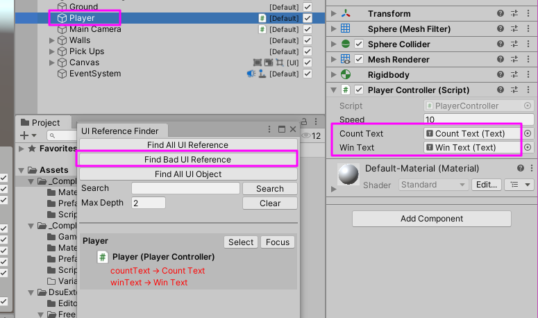

위 그림은 기존 Roll-a-Ball에 대해서 UIReferenceFinder가 나쁜 UI참조를 보고하는 화면입니다.

## 2. GameEvent Pattern

Gameplay와 관련된 이벤트를 하나의 집중된 곳에서 처리하는 것을 코드를 유지보수하는 것을 쉽게 만듭니다.
예를 들면 Player와 Item이 충돌한 경우, 이것을 처리하는 루틴을 PlayerController코드 혹은 ItemController코드에도 두지 않고, 별도의 GameplayManager에서 처리하는 것입니다. 또한, 하나의 Gameplay이벤트에 대해서, 일반적인 gameplay이벤트 처리와 UI 이벤트 처리를 분리하여, 두 곳 이상에서 관리하기를 원한다면, 이러한 구성이 Unity의 Hierarchy에서 시각적으로 표시되고 관리가 가능하도록 해야 합니다.

### 2.1. 이벤트 발생

예를 들면 PlayerController에서 아이템 PickUp과 관련된 이벤트 처리를 원한다고 합시다. 그러면 먼저 PlayerController.cs에 다음과 같이 DsuGameEvent타입의 변수를 추가합니다.

``` csharp
public class PlayerControllerNew : MonoBehaviour {
	
	public float speed;
	private Rigidbody rb;
	public DsuGameEvent pickupEvent;
```

그리고 DsuGameEvent객체(Scriptable Object)를 하나 생성합니다. 이름을 PickupEvent라고 설정합니다. 

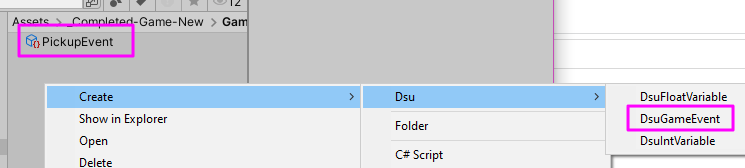

그리고 이것을 PlayerController의 pickupEvent참조에 할당합니다.

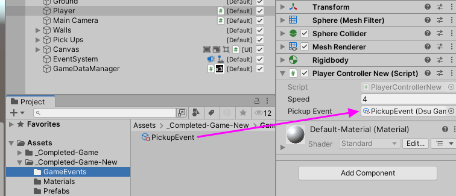

PlayerController내부에서는 이벤트를 발생시키기 위해 pickupEvent의 Raise()를 호출할 필요가 있습니다.

``` csharp

	void OnTriggerEnter(Collider other) 
	{
		// ..and if the game object we intersect has the tag 'Pick Up' assigned to it..
		if (other.gameObject.CompareTag ("Pick Up"))
		{
			pickupEvent?.Raise(0, this.transform, other.transform);
		}
	}
```

DsuGameEvent의 파라미터는 모두 세개입니다. 첫번째 인자는 게임이벤트의 종류를 구분하기 위해서 사용자가 임의의 값을 사용할 수 있습니다. 두번째 인자와 세번째 인자는 모두 Transform타입입니다. 각 Gameplay 이벤트에 적절하게 파라미터의 사용을 가정할 수 있습니다. 예를 들면 Trigger이벤트의 경우, 첫번째 Transform은 OnTriggerEnter를 처리하는 게임 객체, 두번째 Transform은 충돌된 두번째 객체의 Transform등입니다.

Gameplay 이벤트에 따라서 Transform이 필요없을 수도 있습니다. 그러한 경우, Raise()의 첫번째 인자 iParam만 적절하게 이용하도록 파라미터를 구성할 수 있습니다.


### 2.2. 이벤트 처리

이제 PickupEvent를 GameplayManager에서 처리하려고 합니다. 그러면 GameplayManager에 다음과 같이 핸들러 메서드를 추가합니다.

``` csharp
    public void OnPickupEvent(int eventID, Transform sender, Transform other)
    {
        //Debug.Log($"Pickup event received from: {sender.name}, picked up: {other.name}");
        int counter = other.gameObject.Counter();
        other.gameObject.SetActive(false);
        NewRuntimeGameDataManager.instance.Count += counter;
    }
```

다음으로 PickupEvent에 대한 처리를 GameplayManager.OnPickupEvent 가 처리하도록 매핑해야 합니다. Hierarchy에서 GameDataManager를 선택하고, DsuGameEventListener 컴포넌트를 추가합니다.
그리고 PickupEvent를 선택해서 DsuGameEventListener의 Event 슬럿에 설정합니다.

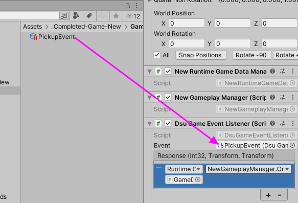

그리고 +버튼을 눌러서 실제 이벤트를 처리할 UnityEvent를 설정해 주어야 합니다. 대상 객체에 GameDataManager를 설정합니다. 그리고 GameplayManager의 OnPickupEvent()를 설정해 주면 됩니다.

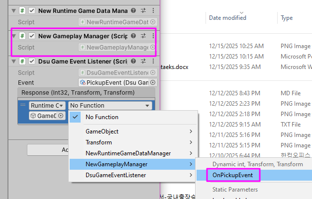

위 그림은 NewGameplayManager의 OnPickupEvent를 이벤트 핸들러로 설정하는 화면입니다.

PickupEvent를 또 다른 곳에서 처리해야 한다면, 해당 객체에 DsuGameEventListener 컴포넌트를 추가하고 적절하게 이벤트 핸들러를 매핑하면 됩니다. 이러한 구조는 하나의 이벤트가 발생했을 때, 여러개의 핸들러가 적절한 곳에서 구현하도록 프로그램 구조를 모듈화합니다.

---

DsuGameEventListener 컴포넌트를 사용하지 않고, GameplayManager에서 직접 이벤트 처리를 원할 수도 있습니다. 그러한 경우에는 다음과 같이 DsuGameEventReference 변수를 선언해야 합니다. DsuGameEventReference를 사용하는 경우, 스크립트에서 직접 이벤트 액션을 추가할 수 있습니다. 이러한 경우, Inspector에서 Response 설정은 필요하지 않을 수도 있습니다.

``` csharp
public class NewGameplayManager : DsuGameplayManagerBase
{
    public DsuGameEventReference pickupEventRef;

    private void OnEnable()
    {
        pickupEventRef.RegisterAction(OnPickupEvent);
    }

    private void OnDisable()
    {
        pickupEventRef.UnregisterAction(OnPickupEvent);
    }
```

아래 그림을 보면, GameDataManager에는 DsuGameEventListener 컴포넌트가 추가되어 있지 않습니다. 또한, Pickup Event Ref의 Response도 값을 가지지 않습니다. 

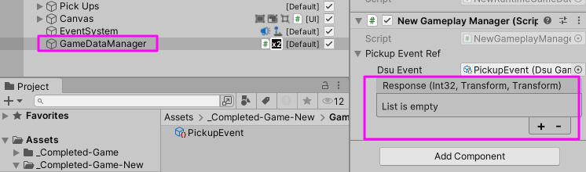

 하나의 게임객체가 수십개의 게임플레이 이벤트를 처리해야 한다면, 각 이벤트마다 DsuGameEventListener를 추가하는 것을 코드를 복잡하게 만듭니다. 이러한 경우 DsuGameEventReference의 일차원 배열을 사용하는 것이 코드를 깔끔하게 만듭니다.

---

이벤트를 Hierarchy에 노출시키지 않고 내부적으로 처리를 원한다면, DsuGameplayEvents.cs에 정의된 GameplayEvent 클래스를 사용해야 합니다.

``` csharp
namespace Dsu.Framework
{
    public class GameplayEvent
    {
        public int Id { get; private set; }

        public GameplayEvent(object id_)
        {
            Id = (int)id_;
        }

        public override string ToString() => Id.ToString();
        public static readonly GameplayEvent NullGameplayEvent = new GameplayEvent(0);
    }//class GameplayEvent
```

GameplayEvent를 사용한 경우에는 GameplayManager의 OnGameplayEvent()에서 이벤트를 핸들링 해야 합니다.

``` csharp
    public override void OnGameplayEvent(object sender, GameplayEventArgsBase args)
    {
        GameObject gameObject = sender as GameObject;
        //if (args.Event == GameplayEvents.CustomGameplayEventFromHere)
        //{
        //    OnCustomGameplayEvent(gameObject, args);
        //}
    }
```

## 3. GameObject Property

GameObject에 사용자 정의 속성을 추가할 수 있습니다. 사용자 정의 속성을 추가하기 위해서는 먼저 DsuFramework->GenerateGameObjectProperty Script를 사용해서 GameObjectPropertyScript를 생성합니다.

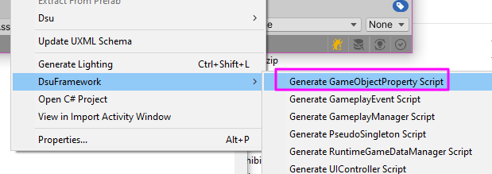

GameObjectPropertyScript는 여러개 생성할 수 있지만, 프로젝트마다 한개씩 생성하는 것을 추천합니다. 그리고 생성된 코드에 사용자가 원하는 속성을 자유롭게 추가할 수 있습니다.
아래의 예는 counter라는 속성을 추가하는 예입니다. 그러면 모든 GameObject에 대해서 Counter()를 호출하는 것이 가능합니다.

``` csharp
namespace Dsu.Framework
{
    public partial class GameObjectPropertyData
    {
        public override void Reset()
        {
            counter = 0;
        }
        public int counter;
    }

    public static partial class DsuGameObjectExtensions
    {
        public static int Counter(this GameObject go)
        {
            _AddKey(go);
            return _objectDictionary[go.transform].propertyData.counter;
        }
    }
}
```

Counter()를 호출하는 것은 Dictionary 자료구조를 사용하여 상수시간에 호출됩니다. 그리고 모든 게임객체에 대해서 Counter를 호출하는 것이 가능합니다. 특정한 게임객체의 counter값을 조정하고 싶다면, 해당 게임 객체에 GameObjectProperty 컴포넌트를 추가하고, counter값을 적절하게 설정해야 합니다. 아래 그림은 특정한 게임 객체의 counter를 2로 설정하는 예를 보여줍니다.

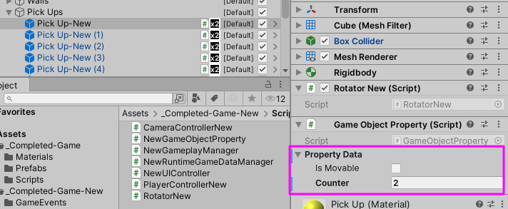

이제 GameplayManager클래스에서 PickupEvent를 처리할 때, 대상 객체의 Counter()값을 얻을 수 있습니다. 아래의 코드는 OnPickupEvent()에서 대상 객체의 counter를 사용하는 방법을 보여줍니다.

``` csharp
    public void OnPickupEvent(int eventID, Transform sender, Transform other)
    {
        //Debug.Log($"Pickup event received from: {sender.name}, picked up: {other.name}");
        int counter = other.gameObject.Counter();
        other.gameObject.SetActive(false);
        NewRuntimeGameDataManager.instance.Count += counter;
    }
```

특정한 게임객체에 대해서 Counter()를 호출했을 때, 대상 객체가 GameObjectProperty 컴포넌트를 가지고 있지 않다면 해당 컴포넌트가 자동으로 추가됩니다. 사용자가 정의한 속성의 값들은 C#의 기본 타입 시스템에 의한 기본값으로 초기화됩니다.